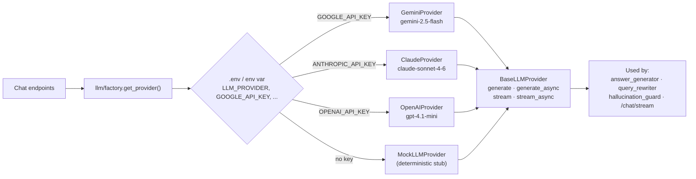

# MITAOE Assistant — Architecture

A grounded RAG stack built across six phases. **Offline pipeline** prepares the corpus once; **online pipeline** answers each query.

---

## 1. System overview

```mermaid
flowchart LR
    subgraph OFFLINE["Offline pipeline (run once per corpus update)"]
        CSV[("Scraped CSV<br/>~11 MB / 934 pages")]
        CSV --> ING["Ingestion<br/>clean · dedup · classify"]
        ING --> DOCS[("processed_documents.json")]
        DOCS --> CHUNK["Semantic chunker"]
        CHUNK --> CHUNKS[("chunks.jsonl<br/>1893 chunks")]
        CHUNKS --> NORM["Phase 2+3 normalization<br/>page type · section type<br/>quality flags · components<br/>contamination · hierarchy"]
        NORM --> NCHUNKS[("normalized_chunks.jsonl")]
        NCHUNKS --> EMBED["Embedding pipeline<br/>BAAI/bge-small-en-v1.5<br/>(skip components+contaminated)"]
        EMBED --> ECHUNKS[("embedded_chunks.jsonl<br/>1308 vectors · 384-dim")]
        ECHUNKS --> QINGEST["Qdrant ingest"]
    end

    subgraph STORAGE["Storage layer"]
        NCHUNKS_S[("normalized_chunks.jsonl<br/>BM25 corpus")]
        QDRANT[("Qdrant local<br/>mitaoe_chunks<br/>1308 vectors + metadata")]
        MEMORY[("In-memory<br/>session store")]
        QINGEST --> QDRANT
        NCHUNKS -.->|read at startup| NCHUNKS_S
    end

    subgraph ONLINE["Online per-query pipeline"]
        USER[/"User query"/]
        USER --> CHAT["Chat API<br/>POST /chat or /chat/stream"]
        CHAT --> REWRITE["Followup rewrite<br/>only if marker detected"]
        REWRITE --> ROUTE["Intent router + query expansion"]
        ROUTE --> BM25["BM25 retrieval<br/>(routed, weighted)"]
        ROUTE --> DENSE["Dense retrieval<br/>(Qdrant + payload filter)"]
        BM25 --> FUSE["Reciprocal rank fusion<br/>k=60"]
        DENSE --> FUSE
        FUSE --> RERANK["Cross-encoder rerank<br/>BAAI/bge-reranker-base"]
        RERANK --> DIV["Diversity caps + dedup<br/>≤2 per section_type"]
        DIV --> CTX["Context assembly<br/>token budget · citations · grounding"]
        CTX --> LLM["LLM<br/>Gemini 2.5 Flash"]
        LLM --> GUARD["Abstention + hallucination guard"]
        GUARD --> ANSWER[/"Grounded answer<br/>with citations"/]
        ANSWER -.->|persist turn| MEMORY
        MEMORY -.->|prior entities| REWRITE
    end

    NCHUNKS_S -.->|tokenized at startup| BM25
    QDRANT -.->|vector search| DENSE
```



**Key numbers** for the current corpus:
- 1893 chunks total → 1308 embedded (547 reusable components + 38 contaminated chunks excluded)
- 4 retrieval modes available: BM25, dense, hybrid, reranked
- 260 tests, 8-pair QA eval set

---

## 2. Per-query pipeline detail

```mermaid
flowchart TD
    Q["User query<br/>e.g. 'what about hostel fees?'"] --> SESS{"Session ID<br/>has prior turns?"}
    SESS -- yes --> FU{"Has followup marker?<br/>(and / what about / also / ...)"}
    SESS -- no --> R0["Use query as-is"]
    FU -- yes --> RW["LLM rewrite<br/>+ entity augment<br/>'what are hostel fees for MCA?'"]
    FU -- no --> R0
    RW --> R0

    R0 --> INTENT["Intent router<br/>10 intents → allowed page_types"]
    INTENT --> EXPAND["Query expansion<br/>synonym map"]

    EXPAND --> BM["BM25Okapi<br/>over normalized_chunks<br/>global IDF"]
    EXPAND --> EMBQ["Embed query<br/>bge-small"]
    EMBQ --> QDR["Qdrant search<br/>cosine · payload filter"]

    BM --> WBM25["Weighted ranker<br/>0.7·BM25 + 0.2·priority + 0.1·section_match"]
    WBM25 --> POOL["Hybrid candidate pool<br/>20 from each retriever"]
    QDR --> POOL

    POOL --> RRF["Reciprocal rank fusion<br/>sum(1/(k+rank))"]
    RRF --> CE["Cross-encoder<br/>BAAI/bge-reranker-base<br/>scores (query, chunk) pairs"]
    CE --> CALIB["Sigmoid calibrate +<br/>answerability heuristic<br/>final = 0.8·rerank + 0.2·answer"]
    CALIB --> DDUP["rapidfuzz dedup<br/>token_set_ratio ≥ 85"]
    DDUP --> DIVCAP["Diversity caps<br/>≤2 per section_type<br/>≤2 per document"]
    DIVCAP --> TOPK["Top-K reranked<br/>+ rejected list with reasons"]

    TOPK --> BLOCK["Build ContextBlock<br/>per kept chunk"]
    BLOCK --> TOK["Token budget fit<br/>tiktoken · 2000 default"]
    TOK --> GROUND["Grounding validate<br/>confidence = mean(final_relevance)"]
    GROUND --> ABST1{"Pre-LLM<br/>abstention check"}
    ABST1 -- abstain --> OUT1["Abstention answer<br/>+ reason"]
    ABST1 -- ok --> PROMPT["Assemble prompt<br/>numbered citations [1]…[N]"]

    PROMPT --> GEMINI["Gemini call<br/>SYSTEM_PROMPT + context<br/>temp=0, stream or sync"]
    GEMINI --> CITES["Extract citations<br/>parse [N] markers"]
    CITES --> JUDGE{"Run judge?<br/>(sync mode only)"}
    JUDGE -- yes --> HG["LLM-as-judge<br/>hallucination check<br/>JSON: risk + claims"]
    JUDGE -- no --> CONF["Confidence aggregate<br/>0.4 grounding<br/>0.3 (1-halluc.risk)<br/>0.2 citation coverage<br/>0.1 rerank"]
    HG --> ABST2{"Post-LLM<br/>abstention check"}
    ABST2 -- abstain --> OUT1
    ABST2 -- ok --> CONF
    CONF --> OUT2["GroundedAnswer<br/>text · citations · confidence · warnings"]

    OUT1 -.->|persist| MEM2[("Session memory<br/>turns · entities · intent")]
    OUT2 -.->|persist| MEM2
```



The streaming endpoint (`/chat/stream`) skips the judge for latency — the abstention and grounding-confidence guards still apply pre-generation.

---

## 3. Phase-to-module mapping

```mermaid
flowchart LR
    subgraph P1["Phase 1 · Ingestion"]
        P1A["backend/ingestion/<br/>loaders cleaners parsers<br/>extractors normalizers<br/>classifiers validators<br/>services exporters"]
    end
    subgraph P2["Phase 2 · Normalization + routing"]
        P2A["backend/normalization/<br/>page_classifier<br/>semantic_section_typer<br/>quality_flags · canonicalizer<br/>retrieval_priority<br/>metadata_normalizer · pipeline"]
        P2B["backend/retrieval/<br/>intent_router<br/>query_expansion<br/>metadata_filters<br/>weighted_ranker<br/>retrieval_debugger<br/>benchmark_metrics<br/>bm25_service"]
    end
    subgraph P3["Phase 3 · Semantic cleanliness"]
        P3A["backend/normalization/<br/>boilerplate_registry<br/>component_detector<br/>widget_suppressor<br/>hierarchy_extractor<br/>heading_classifier<br/>section_normalizer<br/>semantic_section_splitter<br/>contamination_detector"]
    end
    subgraph P4["Phase 4 · Hybrid retrieval"]
        P4A["backend/embeddings/<br/>embedding_model<br/>embedding_cache<br/>batch_embedder<br/>eligibility · embed_chunks"]
        P4B["backend/vectorstore/<br/>qdrant_client · filters<br/>payload_mapper<br/>collection_manager<br/>ingestion · search"]
        P4C["backend/retrieval/<br/>dense_retrieval<br/>fusion<br/>hybrid_retrieval"]
    end
    subgraph P5["Phase 5 · Reranking + context"]
        P5A["backend/reranking/<br/>reranker_model<br/>rerank_service<br/>score_calibrator<br/>duplicate_suppressor<br/>answerability<br/>semantic_diversity"]
        P5B["backend/context/<br/>context_builder<br/>citation_builder<br/>token_budget · grounding<br/>prompt_assembler<br/>semantic_grouping<br/>context_deduplicator"]
        P5C["backend/retrieval/<br/>reranked_retrieval<br/>retrieval_evaluator"]
    end
    subgraph P6["Phase 6 · LLM answering + chat"]
        P6A["backend/llm/<br/>provider_interface<br/>gemini · openai · claude<br/>mock_provider<br/>retry · streaming<br/>model_registry · factory<br/>prompts/"]
        P6B["backend/answering/<br/>answer_generator<br/>grounded_answering<br/>hallucination_guard<br/>abstention · confidence<br/>citation_formatter<br/>answer_validator<br/>followup_resolution"]
        P6C["backend/conversation/<br/>memory · session_manager<br/>retrieval_state<br/>query_rewriter<br/>context_window"]
        P6D["backend/evaluation/<br/>answer_quality<br/>grounding_metrics<br/>hallucination_metrics<br/>qa_sets/grounded_qa.json"]
        P6E["backend/api/<br/>main · chat_models<br/>chat_ui · INSPECTOR_HTML"]
    end

    P1 --> P2 --> P3 --> P4 --> P5 --> P6
```



---

## 4. Runtime call shape

```
POST /chat
  body: {query, session_id?, top_k=5, candidate_pool=20, token_budget=2000, run_judge=true}

  → conversation/memory.append_user_turn(session_id, query)
  → conversation/retrieval_state.extract_entities(query)
  → answering/followup_resolution.resolve_followup_query()
      → conversation/query_rewriter.is_followup_query()  # marker check
      → conversation/query_rewriter.rewrite_query()      # LLM rewrite + length sanity
      → answering/conversational_context.augment_query_with_state()

  → retrieval/reranked_retrieval.RerankedRetrievalService.search()
      → retrieval/hybrid_retrieval.HybridRetrievalService.search()
          → retrieval/bm25_service.BM25RetrievalService.search()
              → retrieval/intent_router.IntentRouter.route()
              → retrieval/query_expansion.expand_query()
              → retrieval/metadata_filters.filter_by_page_types()
              → retrieval/metadata_filters.exclude_reusable_components()
              → retrieval/weighted_ranker.rank_candidates()
          → retrieval/dense_retrieval.DenseRetrievalService.search()
              → embeddings/embedding_model.EmbeddingModel.embed_query()
              → vectorstore/filters.build_intent_filter()
              → vectorstore/search.qdrant_search()
          → retrieval/fusion.reciprocal_rank_fusion()
      → reranking/rerank_service.RerankService.rerank()
          → reranking/reranker_model.RerankerModel.score()
          → reranking/score_calibrator.calibrate() + combine_relevance()
          → reranking/answerability.compute_answerability_score()
          → reranking/duplicate_suppressor.suppress_semantic_duplicates()
          → reranking/semantic_diversity.diversity_rejection_reason()

  → context/context_builder.build_grounded_context()
      → context/citation_builder.build_citation()
      → context/token_budget.count_tokens() + fit_to_budget()
      → context/context_deduplicator.deduplicate_context_blocks()
      → context/grounding.validate_grounded_context()
      → context/prompt_assembler.assemble_prompt()

  → answering/grounded_answering.GroundedAnsweringService.answer()
      → answering/abstention.should_abstain()   # pre-LLM
      → answering/answer_generator.generate_answer()
          → llm/factory.get_provider() → GeminiProvider
          → provider.generate(LLMRequest)
      → answering/citation_formatter.build_citations()
      → answering/answer_validator.validate_answer()
      → answering/hallucination_guard.validate_grounded_answer()   # LLM-as-judge
      → answering/abstention.should_abstain()   # post-LLM
      → answering/confidence.compute_answer_confidence()

  → conversation/memory.append_assistant_turn()
  → return ChatResponse
```

---

## 5. Storage shapes

| File / store | Source | Shape | Used by |
|---|---|---|---|
| `dataset_website-content-crawler_*.csv` | scraper | raw HTML rows | ingestion |
| `datasets/processed_documents.json` | ingestion | `WebsiteDocument[]` | chunker, normalizer |
| `datasets/chunks.jsonl` | chunker | `SemanticChunk[]` | Phase 2 normalizer |
| `datasets/normalized_chunks.jsonl` | normalization | `NormalizedChunk[]` with 25+ metadata fields | BM25 service, embedder |
| `datasets/embedded_chunks.jsonl` | embeddings | normalized + 384-dim vector | Qdrant ingest |
| `datasets/embedding_cache.npz` | embeddings | hash → vector | embedder re-runs |
| `datasets/qdrant_storage/` | vectorstore | Qdrant local segments | dense + hybrid retrieval |
| `reports/*.json` | benchmarks | metrics | evaluation |
| in-memory `_conversation_memory` | API | `session_id → ConversationState` | chat endpoint |

---

## 6. Provider abstraction (Phase 6)



The same provider is used for answering, rewriting, and judging by default — no provider-specific prompt code lives outside `llm/`.

---

## 7. What the system intentionally does not have

- No autonomous agents / tool calling / planners
- No long-term memory (sessions are in-memory, lost on restart)
- No vector-only retrieval — BM25 is preserved as one half of hybrid
- No LLM-only answers — every claim must be supported by a retrieved chunk
- No multi-step orchestration — retrieve → answer is one round-trip per turn
